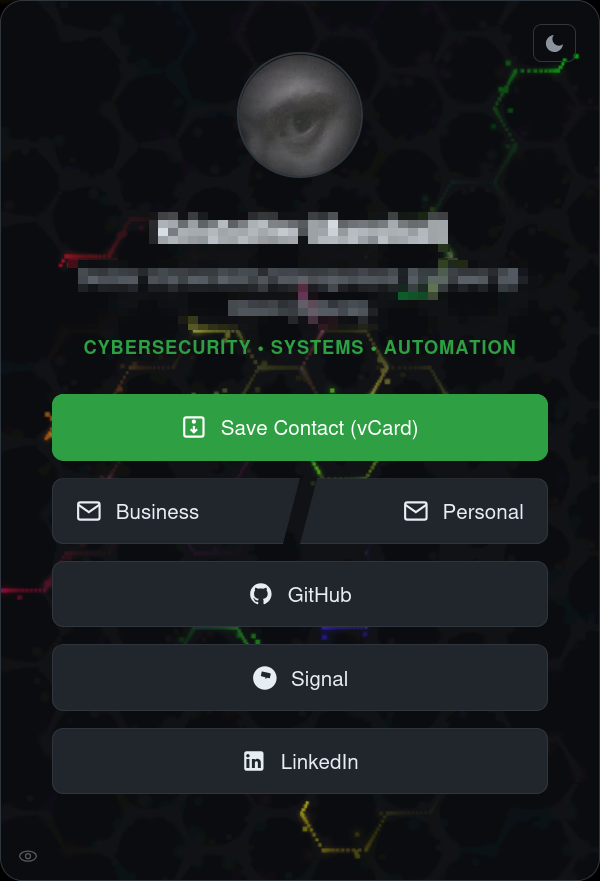

# WhoAmEye



## Description
This is a digital business card with a hidden built-in music player and an animated background.

## Features
* Hidden music player (SomaFM stations)
* Animated background
* Music controls via keyboard
* PWA (Progressive Web App) support
* Ability to favorite stations
* No tracking

# How to Set Up
All personal data is gitignored — the repo contains no private information. To set it up:

1. Copy `personal.example.js` to `personal.js` and fill in your details:
   ```sh
   cp personal.example.js personal.js
   ```
2. Add your profile photo as `vcard-image.jpg`.
3. Add your vCard as `my.vcf` (see `contact.example.vcf` for the format).
4. Optionally update `manifest.json` with your name and description for the PWA.

`personal.js`, `vcard-image.jpg`, `qr-code.png`, `my.vcf`, and `sitemap.xml` are all gitignored and will never be pushed to GitHub.

Everything else — the music player, theming, and animations — works out of the box.

A great way to share your digital business card is to buy a cheap NFC tag, program it with your phone (NFC Tools is great for this), and point it at the URL for your site.

# TODO
* Possibly generate the vCard automatically, based on `personal.js`
